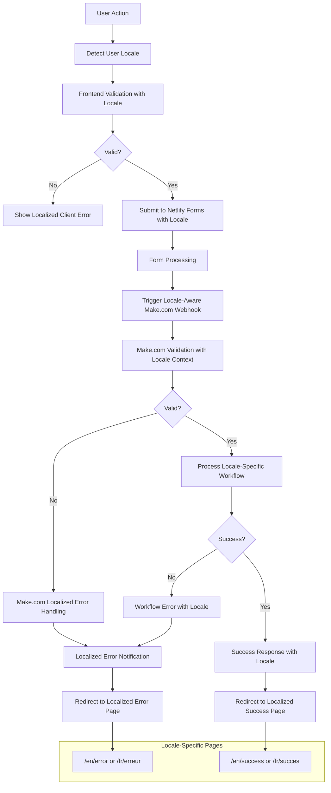

# Error Handling Strategy

### Error Flow



### Error Response Format

```typescript
interface ApiError {
  error: {
    code: string;
    message: string;
    localizedMessage?: {
      en: string;
      fr: string;
    };
    details?: Record<string, any>;
    timestamp: string;
    requestId: string;
    locale?: 'en' | 'fr';
  };
}

// Multilingual error message definitions
interface ErrorMessages {
  [key: string]: {
    en: string;
    fr: string;
  };
}

const ERROR_MESSAGES: ErrorMessages = {
  'FORM_VALIDATION_FAILED': {
    en: 'Please check your form inputs and try again.',
    fr: 'Veuillez vérifier vos entrées de formulaire et réessayer.'
  },
  'NETWORK_ERROR': {
    en: 'Connection error. Please check your internet connection and try again.',
    fr: 'Erreur de connexion. Veuillez vérifier votre connexion Internet et réessayer.'
  },
  'SERVER_ERROR': {
    en: 'Sorry, something went wrong on our end. Please try again later.',
    fr: 'Désolé, quelque chose s\'est mal passé de notre côté. Veuillez réessayer plus tard.'
  },
  'FORM_SUBMISSION_FAILED': {
    en: 'Failed to submit form. Please try again.',
    fr: 'Échec de la soumission du formulaire. Veuillez réessayer.'
  },
  'CONTENT_NOT_AVAILABLE': {
    en: 'This content is not available in your language yet.',
    fr: 'Ce contenu n\'est pas encore disponible dans votre langue.'
  },
  'MISSING_TRANSLATION': {
    en: 'Translation missing. Content creators have been notified.',
    fr: 'Traduction manquante. Les créateurs de contenu ont été notifiés.'
  }
};
```

### Frontend Error Handling

```typescript
// Multilingual error handling utility
export function getLocalizedErrorMessage(
  errorCode: string, 
  locale: 'en' | 'fr' = 'en'
): string {
  const errorMessage = ERROR_MESSAGES[errorCode];
  return errorMessage ? errorMessage[locale] : ERROR_MESSAGES['SERVER_ERROR'][locale];
}

// Detect user locale from URL path or browser settings
export function detectUserLocale(): 'en' | 'fr' {
  // Check URL path first (e.g., /fr/contact vs /en/contact or /contact)
  const pathLocale = window.location.pathname.match(/^\/(en|fr)\//)?.[1];
  if (pathLocale) return pathLocale as 'en' | 'fr';
  
  // Fallback to browser language
  const browserLang = navigator.language.toLowerCase();
  return browserLang.startsWith('fr') ? 'fr' : 'en';
}

export function useErrorHandler() {
  const [error, setError] = useState<string | null>(null);
  const [locale, setLocale] = useState<'en' | 'fr'>(() => detectUserLocale());
  
  const handleError = (error: Error | string, errorCode?: string) => {
    console.error('Application error:', error);
    
    // Use error code if provided, otherwise default to generic server error
    const code = errorCode || 'SERVER_ERROR';
    const localizedMessage = getLocalizedErrorMessage(code, locale);
    
    setError(localizedMessage);
  };
  
  const clearError = () => setError(null);
  
  return { error, handleError, clearError, locale, setLocale };
}

// Error boundary component for React components
export class MultilingualErrorBoundary extends React.Component<
  { children: React.ReactNode; locale?: 'en' | 'fr' },
  { hasError: boolean; locale: 'en' | 'fr' }
> {
  constructor(props: { children: React.ReactNode; locale?: 'en' | 'fr' }) {
    super(props);
    this.state = { 
      hasError: false, 
      locale: props.locale || detectUserLocale() 
    };
  }

  static getDerivedStateFromError(error: Error) {
    return { hasError: true };
  }

  componentDidCatch(error: Error, errorInfo: React.ErrorInfo) {
    console.error('React Error Boundary caught an error:', error, errorInfo);
  }

  render() {
    if (this.state.hasError) {
      const errorMessage = getLocalizedErrorMessage('SERVER_ERROR', this.state.locale);
      
      return (
        <div class="error-boundary" role="alert">
          <h2>{this.state.locale === 'fr' ? 'Quelque chose s\'est mal passé' : 'Something went wrong'}</h2>
          <p>{errorMessage}</p>
          <button 
            onClick={() => this.setState({ hasError: false })}
            className="btn btn-primary"
          >
            {this.state.locale === 'fr' ? 'Réessayer' : 'Try again'}
          </button>
        </div>
      );
    }

    return this.props.children;
  }
}
```

### Form Error Handling

```typescript
// Multilingual form validation messages
const FORM_VALIDATION_MESSAGES = {
  REQUIRED_FIELD: {
    en: 'This field is required.',
    fr: 'Ce champ est obligatoire.'
  },
  INVALID_EMAIL: {
    en: 'Please enter a valid email address.',
    fr: 'Veuillez saisir une adresse e-mail valide.'
  },
  INVALID_PHONE: {
    en: 'Please enter a valid phone number.',
    fr: 'Veuillez saisir un numéro de téléphone valide.'
  },
  MESSAGE_TOO_SHORT: {
    en: 'Message must be at least 10 characters long.',
    fr: 'Le message doit contenir au moins 10 caractères.'
  }
};

// Netlify Forms error handling with Make.com workflows and multilingual support
export function handleFormSubmission(formData: FormData, locale: 'en' | 'fr' = 'en') {
  try {
    // Client-side validation with localized messages
    const validatedData = validateFormData(formData, locale);
    
    // Add locale to form data for backend processing
    const form = document.querySelector('form[data-netlify="true"]') as HTMLFormElement;
    if (form) {
      // Add hidden locale field if not already present
      let localeInput = form.querySelector('input[name="locale"]') as HTMLInputElement;
      if (!localeInput) {
        localeInput = document.createElement('input');
        localeInput.type = 'hidden';
        localeInput.name = 'locale';
        form.appendChild(localeInput);
      }
      localeInput.value = locale;
      
      form.submit();
    }
    
    // Success handling via redirect to localized success page
    const successPath = locale === 'fr' ? '/fr/succes' : '/en/success';
    window.location.href = successPath;
  } catch (error) {
    // Display localized validation errors
    showFormErrors(error.message, locale);
  }
}

// Form validation with multilingual error messages
export function validateFormData(formData: FormData, locale: 'en' | 'fr'): FormData {
  const errors: string[] = [];
  
  // Required field validation
  const requiredFields = ['firstName', 'lastName', 'email'];
  requiredFields.forEach(field => {
    if (!formData.get(field)) {
      errors.push(FORM_VALIDATION_MESSAGES.REQUIRED_FIELD[locale]);
    }
  });
  
  // Email validation
  const email = formData.get('email') as string;
  if (email && !isValidEmail(email)) {
    errors.push(FORM_VALIDATION_MESSAGES.INVALID_EMAIL[locale]);
  }
  
  // Phone validation (if provided)
  const phone = formData.get('phone') as string;
  if (phone && !isValidPhone(phone)) {
    errors.push(FORM_VALIDATION_MESSAGES.INVALID_PHONE[locale]);
  }
  
  // Message length validation
  const message = formData.get('message') as string;
  if (message && message.length < 10) {
    errors.push(FORM_VALIDATION_MESSAGES.MESSAGE_TOO_SHORT[locale]);
  }
  
  if (errors.length > 0) {
    throw new Error(errors.join(' '));
  }
  
  return formData;
}

// Display form errors with proper localization
export function showFormErrors(errorMessage: string, locale: 'en' | 'fr') {
  const errorContainer = document.querySelector('.form-errors');
  if (errorContainer) {
    errorContainer.innerHTML = `
      <div class="alert alert-error" role="alert">
        <h3>${locale === 'fr' ? 'Erreurs de formulaire' : 'Form Errors'}</h3>
        <p>${errorMessage}</p>
      </div>
    `;
    errorContainer.scrollIntoView({ behavior: 'smooth' });
  }
}

// Make.com webhook error handling with multilingual support
// Configured within Make.com scenarios:
// 1. Data validation filters (including locale-aware validation)
// 2. Error handling routes with locale-specific email templates
// 3. Retry logic with exponential backoff
// 4. Admin notifications for failures (include user locale context)
// 5. Locale-aware redirect URLs for success/error pages

// Example Make.com webhook payload structure:
/*
{
  "formData": {
    "firstName": "John",
    "lastName": "Doe", 
    "email": "john@example.com",
    "message": "Hello world",
    "locale": "fr"
  },
  "metadata": {
    "submissionTime": "2025-06-23T10:30:00Z",
    "userAgent": "Mozilla/5.0...",
    "referrerUrl": "https://colourfullydigital.ca/fr/contact"
  }
}
*/
```
