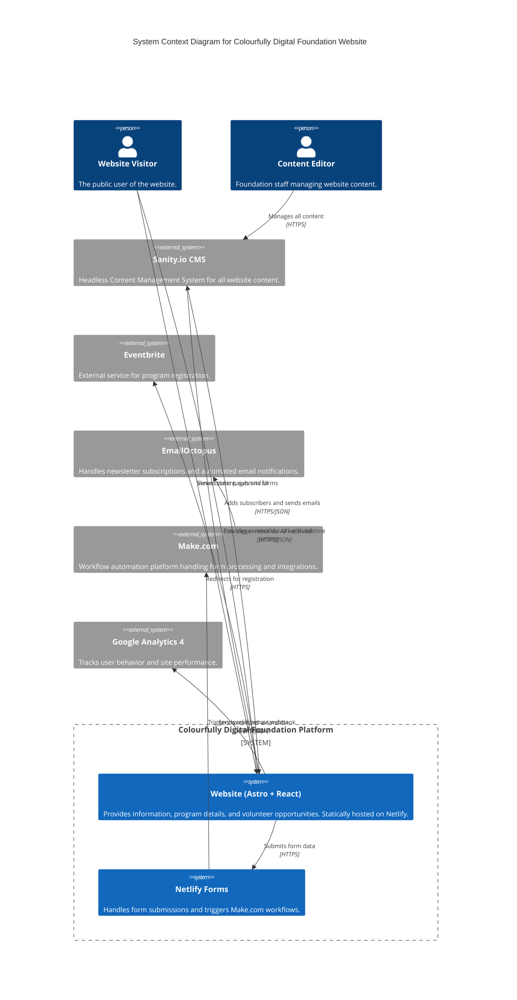

# High Level Architecture

### Technical Summary

This document outlines a headless architecture for the Colourfully Digital Foundation website. The primary goal is to create a flexible, scalable, and maintainable platform to support the foundation's mission of providing accessible STEM education. The system will leverage Sanity.io as a headless CMS for all content, a statically-generated frontend built with Astro and interactive React components, and Netlify Forms with Make.com workflows for dynamic operations like form submissions and backend automation. All code will be managed within a single monorepo to facilitate code sharing and streamlined development.

### Platform and Infrastructure Choice

**Platform:** Netlify

**Key Services:** Static Hosting, Netlify Forms, Build Automation, Deploy Previews

**Deployment Host and Regions:** Global CDN with automatic regional distribution

### Repository Structure

**Structure:** Monorepo

**Monorepo Tool:** Turborepo with pnpm workspaces

**Package Organization:** Apps (website), packages (shared libraries)

### High Level Architecture Diagram

### Architectural Patterns

- **Jamstack Architecture:** Static site generation with form-based APIs - _Rationale:_ Optimal performance and scalability for content-heavy applications with decoupled content management
- **Island Architecture:** Static HTML with selective React component hydration - _Rationale:_ Minimal JavaScript bundle size while maintaining interactivity where needed
- **Workflow Automation (iPaaS):** Form processing via Make.com workflows - _Rationale:_ Cost-effective backend logic without server management
- **Repository Pattern:** Abstracted data access to external systems - _Rationale:_ Decouples business logic from data source implementation details
