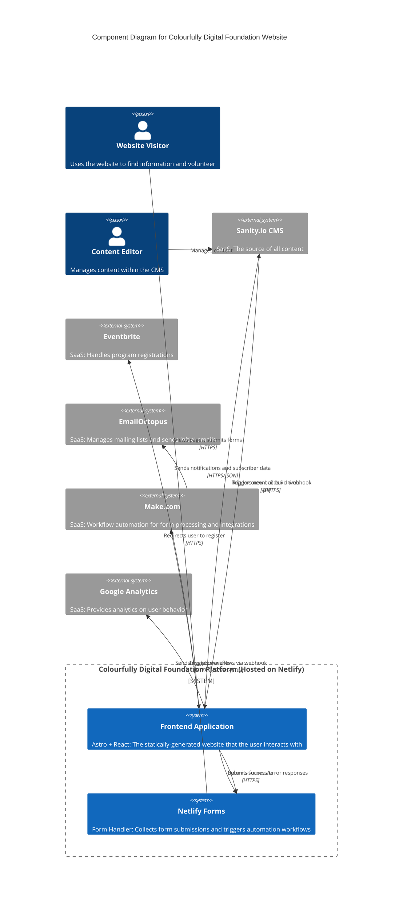

# Tech Stack

### Technology Stack Table

### Frontend Application (Astro + React Islands)

**Responsibility:** Core user-facing website with static content and interactive components

**Key Interfaces:**

- Sanity.io Content API for build-time data fetching
- Netlify Forms for form submissions
- External service redirects (Eventbrite)

**Dependencies:** Sanity.io CMS, Netlify Forms, Make.com

**Technology Stack:** Astro 5.9, React 19.0.0, TypeScript, Tailwind CSS

### Form Processing (Netlify Forms + Make.com)

**Responsibility:** Form data collection and automated workflow processing

**Key Interfaces:**

- Netlify Forms for form data collection
- Make.com webhooks for workflow automation
- EmailOctopus API integration
- Document generation services

**Dependencies:** EmailOctopus, Make.com

**Technology Stack:** Netlify Forms, Make.com workflows

### Content Store (Sanity.io CMS)

**Responsibility:** Headless content management and storage

**Key Interfaces:**

- GROQ query API for content retrieval
- Sanity Studio for content editing
- Webhook triggers for build automation

**Dependencies:** None (external SaaS)

**Technology Stack:** Sanity.io 3.x

### Component Diagrams

