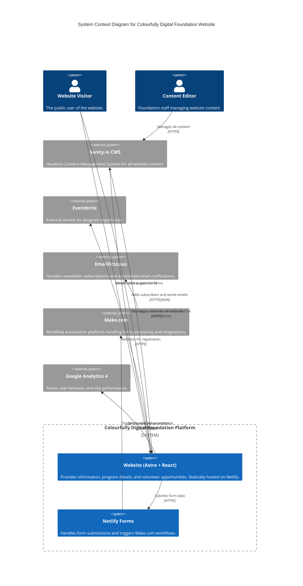
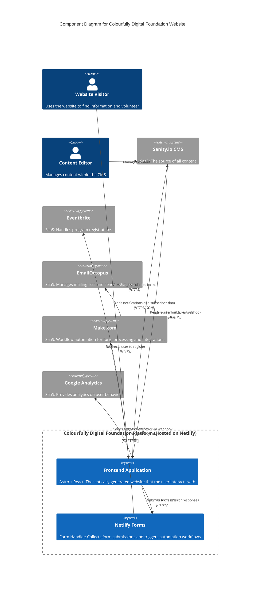
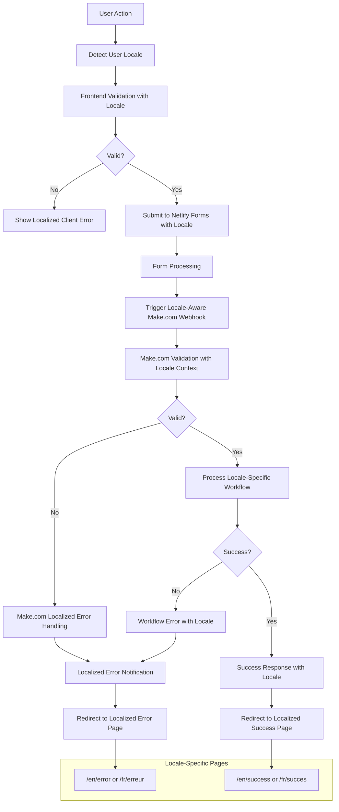

# Colourfully Digital Foundation Fullstack Architecture Document

## Introduction

This document outlines the complete fullstack architecture for the Colourfully Digital Foundation website, including backend systems, frontend implementation, and their integration. It serves as the single source of truth for AI-driven development, ensuring consistency across the entire technology stack.

This unified approach combines what would traditionally be separate backend and frontend architecture documents, streamlining the development process for modern fullstack applications where these concerns are increasingly intertwined.

### Starter Template or Existing Project

N/A - Greenfield project

### Change Log

| Date | Version | Description | Author |
| :--- | :------ | :---------- | :----- |
| 2025-06-22 | 1.0 | Initial architecture document migration | AI Assistant |

## High Level Architecture

### Technical Summary

This document outlines a headless architecture for the Colourfully Digital Foundation website. The primary goal is to create a flexible, scalable, and maintainable platform to support the foundation's mission of providing accessible STEM education. The system will leverage Sanity.io as a headless CMS for all content, a statically-generated frontend built with Astro and interactive React components, and Netlify Forms with Make.com workflows for dynamic operations like form submissions and backend automation. All code will be managed within a single monorepo to facilitate code sharing and streamlined development.

### Platform and Infrastructure Choice

**Platform:** Netlify

**Key Services:** Static Hosting, Netlify Forms, Build Automation, Deploy Previews

**Deployment Host and Regions:** Global CDN with automatic regional distribution

### Repository Structure

**Structure:** Monorepo

**Monorepo Tool:** Turborepo with pnpm workspaces

**Package Organization:** Apps (website), packages (shared libraries)

### High Level Architecture Diagram



### Architectural Patterns

- **Jamstack Architecture:** Static site generation with form-based APIs - _Rationale:_ Optimal performance and scalability for content-heavy applications with decoupled content management
- **Island Architecture:** Static HTML with selective React component hydration - _Rationale:_ Minimal JavaScript bundle size while maintaining interactivity where needed
- **Workflow Automation (iPaaS):** Form processing via Make.com workflows - _Rationale:_ Cost-effective backend logic without server management
- **Repository Pattern:** Abstracted data access to external systems - _Rationale:_ Decouples business logic from data source implementation details

## Tech Stack

### Technology Stack Table

### Frontend Application (Astro + React Islands)

**Responsibility:** Core user-facing website with static content and interactive components

**Key Interfaces:**

- Sanity.io Content API for build-time data fetching
- Netlify Forms for form submissions
- External service redirects (Eventbrite)

**Dependencies:** Sanity.io CMS, Netlify Forms, Make.com

**Technology Stack:** Astro 5.9, React 19.0.0, TypeScript, Tailwind CSS

### Form Processing (Netlify Forms + Make.com)

**Responsibility:** Form data collection and automated workflow processing

**Key Interfaces:**

- Netlify Forms for form data collection
- Make.com webhooks for workflow automation
- EmailOctopus API integration
- Document generation services

**Dependencies:** EmailOctopus, Make.com

**Technology Stack:** Netlify Forms, Make.com workflows

### Content Store (Sanity.io CMS)

**Responsibility:** Headless content management and storage

**Key Interfaces:**

- GROQ query API for content retrieval
- Sanity Studio for content editing
- Webhook triggers for build automation

**Dependencies:** None (external SaaS)

**Technology Stack:** Sanity.io 3.x

### Component Diagrams



## External APIs

### Sanity.io API

- **Purpose:** Primary content source for website build-time data fetching
- **Documentation:** https://www.sanity.io/docs/http-api
- **Base URL(s):** https://{projectId}.api.sanity.io/v{apiVersion}/data/query/{dataset}
- **Authentication:** Public API token (environment variable)
- **Rate Limits:** Standard SaaS tier limits

**Key Endpoints Used:**

- `GET /data/query/{dataset}` - Fetch content using GROQ queries

**Integration Notes:** Used exclusively at build time for static site generation

### EmailOctopus API

- **Purpose:** Newsletter subscription management and transactional emails
- **Documentation:** https://emailoctopus.com/api-documentation
- **Base URL(s):** https://emailoctopus.com/api/1.6/
- **Authentication:** API Key (secure environment variable)
- **Rate Limits:** Standard SaaS tier limits

**Key Endpoints Used:**

- `POST /lists/{list_id}/contacts` - Add contacts to mailing lists

**Integration Notes:** Triggered by Make.com workflows for automated processing

### Make.com Webhook API

- **Purpose:** Workflow automation for form processing and integrations
- **Documentation:** Make.com webhook documentation
- **Base URL(s):** Custom webhook URLs (secret)
- **Authentication:** Secret webhook URL
- **Rate Limits:** Based on Make.com plan

**Key Endpoints Used:**

- `POST /{secret-webhook-path}` - Trigger automation workflows

**Integration Notes:** Receives form data from Netlify Forms and processes all backend logic

### Eventbrite API

- **Purpose:** Program registration redirects (no API integration)
- **Documentation:** N/A for current implementation
- **Base URL(s):** Public event pages
- **Authentication:** None required
- **Rate Limits:** N/A

**Key Endpoints Used:**

- Direct hyperlinks to public event pages

**Integration Notes:** Simple redirect approach for MVP

### Google Analytics 4

- **Purpose:** Client-side user behavior tracking
- **Documentation:** Google Analytics documentation
- **Base URL(s):** Google Analytics endpoints
- **Authentication:** Measurement ID
- **Rate Limits:** Standard GA4 limits

**Key Endpoints Used:**

- Client-side gtag.js integration

**Integration Notes:** Pure client-side implementation, no server API calls

## Development Workflow

### Local Development Setup

**Prerequisites:**

```bash
# Install Node.js 18+ and pnpm
node --version  # >= 18.0.0
pnpm --version  # >= 8.0.0
```

**Initial Setup:**

```bash
# Clone repository and install dependencies
git clone <repository-url>
cd colourfully-digital-monorepo
pnpm install

# Set up environment variables
cp .env.example .env.local
# Edit .env.local with your API keys
```

**Development Commands:**

```bash
# Start all services
pnpm dev

# Start frontend only
pnpm --filter website dev

# Build for production
pnpm build

# Run tests
pnpm test
```

### Environment Configuration

**Required Environment Variables:**

```bash
# Frontend (.env.local)
SANITY_PROJECT_ID=your_project_id
SANITY_DATASET=production
PUBLIC_GOOGLE_ANALYTICS_ID=GA4_MEASUREMENT_ID

# Make.com Webhooks (added to Netlify Forms configuration)
MAKE_WEBHOOK_URL_VOLUNTEER=your_volunteer_webhook_url
MAKE_WEBHOOK_URL_NEWSLETTER=your_newsletter_webhook_url

# Shared
NODE_ENV=development
```

## Deployment Architecture

### Deployment Strategy

**Frontend Deployment:**

- **Platform:** Netlify
- **Build Command:** `pnpm build`
- **Output Directory:** `apps/website/dist`
- **CDN/Edge:** Netlify global CDN with automatic optimization

**Form Processing:**

- **Platform:** Netlify Forms (free tier)
- **Configuration:** netlify.toml file
- **Automation:** Make.com webhooks triggered by form submissions

### CI/CD Pipeline

```yaml
# .github/workflows/deploy.yml
name: Deploy to Netlify
on:
  push:
    branches: [main]
  pull_request:
    branches: [main]

jobs:
  deploy:
    runs-on: ubuntu-latest
    steps:
      - uses: actions/checkout@v3
      - uses: pnpm/action-setup@v2
        with:
          version: 8
      - uses: actions/setup-node@v3
        with:
          node-version: 18
          cache: 'pnpm'
      - run: pnpm install
      - run: pnpm test
      - run: pnpm build
      - name: Deploy to Netlify
        uses: netlify/actions/cli@master
        with:
          args: deploy --prod --dir=apps/website/dist
        env:
          NETLIFY_AUTH_TOKEN: ${{ secrets.NETLIFY_AUTH_TOKEN }}
          NETLIFY_SITE_ID: ${{ secrets.NETLIFY_SITE_ID }}
```

### Environments

| Environment | Frontend URL       | Form Processing    | Purpose                |
| :---------- | :----------------- | :----------------- | :--------------------- |
| Development | http://localhost:4321 | Local form testing | Local development      |
| Staging     | https://deploy-preview-*--site.netlify.app | Netlify Forms + Make.com | Pre-production testing |
| Production  | https://www.colourfully.digital | Netlify Forms + Make.com | Live environment       |

## Security and Performance

### Security Requirements

**Frontend Security:**

- CSP Headers: Configured via netlify.toml
- XSS Prevention: React JSX auto-escaping
- Secure Storage: No sensitive data in local storage

**Form Security:**

- Spam Protection: Netlify Forms built-in anti-spam
- Input Validation: Make.com workflow validation
- Rate Limiting: Netlify platform limits
- CORS Policy: Restricted to production domain

**Authentication Security:**

- Token Storage: Environment variables only
- Session Management: Not applicable (stateless)
- Password Policy: Not applicable (no user auth)

### Performance Optimization

**Frontend Performance:**

- Bundle Size Target: < 100KB initial JS
- Loading Strategy: Static site generation with progressive enhancement
- Caching Strategy: CDN caching + build-time optimization

**Form Performance:**

- Response Time Target: < 200ms for form submission acceptance
- Processing Time: Make.com workflows handle background processing
- Caching Strategy: CDN for static assets, Sanity CDN for images

## Testing Strategy

### Testing Pyramid

```text
        E2E Tests
       /          \
   Frontend Tests    Form Tests
   /                  \
 Component Unit     Integration
```

### Test Organization

**Frontend Tests:**

```text
apps/website/tests/
├── unit/              # Component and utility tests
├── integration/       # Feature integration tests
├── forms/             # Form submission tests
└── e2e/              # End-to-end tests
```

**Form Integration Tests:**

```text
tests/forms/
├── volunteer-form.test.js    # Volunteer application form
└── newsletter-form.test.js   # Newsletter subscription form
```

### Test Examples

**Frontend Component Test:**

```typescript
import { render, screen } from '@testing-library/react';
import { VolunteerForm } from '@/components/forms/VolunteerForm';

test('renders volunteer form fields', () => {
  render(<VolunteerForm />);
  
  expect(screen.getByLabelText(/first name/i)).toBeInTheDocument();
  expect(screen.getByLabelText(/last name/i)).toBeInTheDocument();
  expect(screen.getByLabelText(/email/i)).toBeInTheDocument();
});
```

**Form Integration Test:**

```typescript
import { test, expect } from '@playwright/test';

test('volunteer form submits successfully', async ({ page }) => {
  await page.goto('/volunteer');
  
  await page.fill('[name="firstName"]', 'John');
  await page.fill('[name="lastName"]', 'Doe');
  await page.fill('[name="email"]', 'john@example.com');
  await page.fill('[name="message"]', 'Test message');
  await page.check('[name="consent"]');
  
  await page.click('button[type="submit"]');
  
  await expect(page.locator('.success-message')).toBeVisible();
});
```

## Coding Standards

### Critical Fullstack Rules

- **Type Sharing:** Always define types in packages/types and import from there
- **Environment Variables:** Access only through validated config objects, never process.env directly
- **Form Handling:** All forms must use Netlify Forms with proper validation and error handling
- **State Updates:** Never mutate state directly - use proper React state management patterns
- **Data Validation:** Form validation on both client-side and Make.com workflows

### Naming Conventions

| Element         | Frontend             | Forms      | Example             |
| :-------------- | :------------------- | :--------- | :------------------ |
| Components      | PascalCase           | -          | `VolunteerForm.tsx` |
| Hooks           | camelCase with 'use' | -          | `useFormState.ts`   |
| Form Names      | -                    | kebab-case | `volunteer-application` |
| Types           | PascalCase           | PascalCase | `VolunteerApplicationPayload` |

## Error Handling Strategy

### Error Flow



### Error Response Format

```typescript
interface ApiError {
  error: {
    code: string;
    message: string;
    localizedMessage?: {
      en: string;
      fr: string;
    };
    details?: Record<string, any>;
    timestamp: string;
    requestId: string;
    locale?: 'en' | 'fr';
  };
}

// Multilingual error message definitions
interface ErrorMessages {
  [key: string]: {
    en: string;
    fr: string;
  };
}

const ERROR_MESSAGES: ErrorMessages = {
  'FORM_VALIDATION_FAILED': {
    en: 'Please check your form inputs and try again.',
    fr: 'Veuillez vérifier vos entrées de formulaire et réessayer.'
  },
  'NETWORK_ERROR': {
    en: 'Connection error. Please check your internet connection and try again.',
    fr: 'Erreur de connexion. Veuillez vérifier votre connexion Internet et réessayer.'
  },
  'SERVER_ERROR': {
    en: 'Sorry, something went wrong on our end. Please try again later.',
    fr: 'Désolé, quelque chose s\'est mal passé de notre côté. Veuillez réessayer plus tard.'
  },
  'FORM_SUBMISSION_FAILED': {
    en: 'Failed to submit form. Please try again.',
    fr: 'Échec de la soumission du formulaire. Veuillez réessayer.'
  },
  'CONTENT_NOT_AVAILABLE': {
    en: 'This content is not available in your language yet.',
    fr: 'Ce contenu n\'est pas encore disponible dans votre langue.'
  },
  'MISSING_TRANSLATION': {
    en: 'Translation missing. Content creators have been notified.',
    fr: 'Traduction manquante. Les créateurs de contenu ont été notifiés.'
  }
};
```

### Frontend Error Handling

```typescript
// Multilingual error handling utility
export function getLocalizedErrorMessage(
  errorCode: string, 
  locale: 'en' | 'fr' = 'en'
): string {
  const errorMessage = ERROR_MESSAGES[errorCode];
  return errorMessage ? errorMessage[locale] : ERROR_MESSAGES['SERVER_ERROR'][locale];
}

// Detect user locale from URL path or browser settings
export function detectUserLocale(): 'en' | 'fr' {
  // Check URL path first (e.g., /fr/contact vs /en/contact or /contact)
  const pathLocale = window.location.pathname.match(/^\/(en|fr)\//)?.[1];
  if (pathLocale) return pathLocale as 'en' | 'fr';
  
  // Fallback to browser language
  const browserLang = navigator.language.toLowerCase();
  return browserLang.startsWith('fr') ? 'fr' : 'en';
}

export function useErrorHandler() {
  const [error, setError] = useState<string | null>(null);
  const [locale, setLocale] = useState<'en' | 'fr'>(() => detectUserLocale());
  
  const handleError = (error: Error | string, errorCode?: string) => {
    console.error('Application error:', error);
    
    // Use error code if provided, otherwise default to generic server error
    const code = errorCode || 'SERVER_ERROR';
    const localizedMessage = getLocalizedErrorMessage(code, locale);
    
    setError(localizedMessage);
  };
  
  const clearError = () => setError(null);
  
  return { error, handleError, clearError, locale, setLocale };
}

// Error boundary component for React components
export class MultilingualErrorBoundary extends React.Component<
  { children: React.ReactNode; locale?: 'en' | 'fr' },
  { hasError: boolean; locale: 'en' | 'fr' }
> {
  constructor(props: { children: React.ReactNode; locale?: 'en' | 'fr' }) {
    super(props);
    this.state = { 
      hasError: false, 
      locale: props.locale || detectUserLocale() 
    };
  }

  static getDerivedStateFromError(error: Error) {
    return { hasError: true };
  }

  componentDidCatch(error: Error, errorInfo: React.ErrorInfo) {
    console.error('React Error Boundary caught an error:', error, errorInfo);
  }

  render() {
    if (this.state.hasError) {
      const errorMessage = getLocalizedErrorMessage('SERVER_ERROR', this.state.locale);
      
      return (
        <div className="error-boundary" role="alert">
          <h2>{this.state.locale === 'fr' ? 'Quelque chose s\'est mal passé' : 'Something went wrong'}</h2>
          <p>{errorMessage}</p>
          <button 
            onClick={() => this.setState({ hasError: false })}
            className="btn btn-primary"
          >
            {this.state.locale === 'fr' ? 'Réessayer' : 'Try again'}
          </button>
        </div>
      );
    }

    return this.props.children;
  }
}
```

### Form Error Handling

```typescript
// Multilingual form validation messages
const FORM_VALIDATION_MESSAGES = {
  REQUIRED_FIELD: {
    en: 'This field is required.',
    fr: 'Ce champ est obligatoire.'
  },
  INVALID_EMAIL: {
    en: 'Please enter a valid email address.',
    fr: 'Veuillez saisir une adresse e-mail valide.'
  },
  INVALID_PHONE: {
    en: 'Please enter a valid phone number.',
    fr: 'Veuillez saisir un numéro de téléphone valide.'
  },
  MESSAGE_TOO_SHORT: {
    en: 'Message must be at least 10 characters long.',
    fr: 'Le message doit contenir au moins 10 caractères.'
  }
};

// Netlify Forms error handling with Make.com workflows and multilingual support
export function handleFormSubmission(formData: FormData, locale: 'en' | 'fr' = 'en') {
  try {
    // Client-side validation with localized messages
    const validatedData = validateFormData(formData, locale);
    
    // Add locale to form data for backend processing
    const form = document.querySelector('form[data-netlify="true"]') as HTMLFormElement;
    if (form) {
      // Add hidden locale field if not already present
      let localeInput = form.querySelector('input[name="locale"]') as HTMLInputElement;
      if (!localeInput) {
        localeInput = document.createElement('input');
        localeInput.type = 'hidden';
        localeInput.name = 'locale';
        form.appendChild(localeInput);
      }
      localeInput.value = locale;
      
      form.submit();
    }
    
    // Success handling via redirect to localized success page
    const successPath = locale === 'fr' ? '/fr/succes' : '/en/success';
    window.location.href = successPath;
  } catch (error) {
    // Display localized validation errors
    showFormErrors(error.message, locale);
  }
}

// Form validation with multilingual error messages
export function validateFormData(formData: FormData, locale: 'en' | 'fr'): FormData {
  const errors: string[] = [];
  
  // Required field validation
  const requiredFields = ['firstName', 'lastName', 'email'];
  requiredFields.forEach(field => {
    if (!formData.get(field)) {
      errors.push(FORM_VALIDATION_MESSAGES.REQUIRED_FIELD[locale]);
    }
  });
  
  // Email validation
  const email = formData.get('email') as string;
  if (email && !isValidEmail(email)) {
    errors.push(FORM_VALIDATION_MESSAGES.INVALID_EMAIL[locale]);
  }
  
  // Phone validation (if provided)
  const phone = formData.get('phone') as string;
  if (phone && !isValidPhone(phone)) {
    errors.push(FORM_VALIDATION_MESSAGES.INVALID_PHONE[locale]);
  }
  
  // Message length validation
  const message = formData.get('message') as string;
  if (message && message.length < 10) {
    errors.push(FORM_VALIDATION_MESSAGES.MESSAGE_TOO_SHORT[locale]);
  }
  
  if (errors.length > 0) {
    throw new Error(errors.join(' '));
  }
  
  return formData;
}

// Display form errors with proper localization
export function showFormErrors(errorMessage: string, locale: 'en' | 'fr') {
  const errorContainer = document.querySelector('.form-errors');
  if (errorContainer) {
    errorContainer.innerHTML = `
      <div class="alert alert-error" role="alert">
        <h3>${locale === 'fr' ? 'Erreurs de formulaire' : 'Form Errors'}</h3>
        <p>${errorMessage}</p>
      </div>
    `;
    errorContainer.scrollIntoView({ behavior: 'smooth' });
  }
}

// Make.com webhook error handling with multilingual support
// Configured within Make.com scenarios:
// 1. Data validation filters (including locale-aware validation)
// 2. Error handling routes with locale-specific email templates
// 3. Retry logic with exponential backoff
// 4. Admin notifications for failures (include user locale context)
// 5. Locale-aware redirect URLs for success/error pages

// Example Make.com webhook payload structure:
/*
{
  "formData": {
    "firstName": "John",
    "lastName": "Doe", 
    "email": "john@example.com",
    "message": "Hello world",
    "locale": "fr"
  },
  "metadata": {
    "submissionTime": "2025-06-23T10:30:00Z",
    "userAgent": "Mozilla/5.0...",
    "referrerUrl": "https://colourfullydigital.ca/fr/contact"
  }
}
*/
```

## Monitoring and Observability

### Monitoring Stack

- **Frontend Monitoring:** Netlify Analytics for pageviews and performance
- **Form Monitoring:** Netlify Forms submission analytics and spam detection
- **Workflow Monitoring:** Make.com execution logs and error tracking
- **Error Tracking:** Console-based logging with structured JSON format including locale context
- **Performance Monitoring:** Lighthouse CI for Core Web Vitals tracking
- **Multilingual Analytics:** Separate tracking for French and English user paths and error patterns

### Key Metrics

**Frontend Metrics:**

- Core Web Vitals (LCP, FID, CLS) by language/locale
- Page load times per language variant
- Form submission success rates by locale
- User interaction tracking with language context
- Error rates segmented by French vs English users

**Form and Workflow Metrics:**

- Form submission success rates by locale (French vs English)
- Validation error frequency by language and field type
- Make.com workflow execution times for locale-specific processes
- External API response times for multilingual content
- Build success/failure rates
- Locale-specific error patterns and user flow analysis
- **Content gap tracking:** Missing content requests by path, locale, and frequency
- **Content prioritization:** High-priority missing translations based on user demand
- **Content team notifications:** Actionable alerts for missing content creation

**Multilingual Error Monitoring:**

```typescript
// Enhanced error logging with locale context and content gap tracking
export function logError(error: Error | string, context: {
  locale?: 'en' | 'fr';
  page?: string;
  userAgent?: string;
  errorCode?: string;
  formField?: string;
  missingContentPath?: string;
  contentType?: string;
}) {
  const errorLog = {
    timestamp: new Date().toISOString(),
    error: typeof error === 'string' ? error : error.message,
    stack: typeof error === 'object' ? error.stack : undefined,
    locale: context.locale || detectUserLocale(),
    page: context.page || window.location.pathname,
    userAgent: context.userAgent || navigator.userAgent,
    errorCode: context.errorCode,
    formField: context.formField,
    referrer: document.referrer,
    sessionId: getSessionId(),
    // Content gap tracking
    missingContentPath: context.missingContentPath,
    contentType: context.contentType
  };
  
  // Log to console for development
  console.error('Application Error:', errorLog);
  
  // Send to analytics if in production
  if (typeof gtag !== 'undefined') {
    gtag('event', 'exception', {
      description: errorLog.error,
      fatal: false,
      custom_map: {
        locale: errorLog.locale,
        error_code: errorLog.errorCode,
        page_path: errorLog.page,
        missing_content_path: errorLog.missingContentPath,
        content_type: errorLog.contentType
      }
    });
  }
  
  // Special handling for missing content - notify content team
  if (context.errorCode === 'CONTENT_NOT_AVAILABLE' && context.missingContentPath) {
    notifyContentTeam({
      missingPath: context.missingContentPath,
      requestedLocale: context.locale,
      contentType: context.contentType,
      userAgent: context.userAgent,
      timestamp: errorLog.timestamp
    });
  }
}

// Function to notify content team of missing content requests
async function notifyContentTeam(contentGap: {
  missingPath: string;
  requestedLocale?: string;
  contentType?: string;
  userAgent?: string;
  timestamp: string;
}) {
  // This could integrate with your content management workflow
  // e.g., create Sanity.io drafts, Slack notifications, GitHub issues, etc.
  
  try {
    // Example: Create a content request in your CMS or tracking system
    await fetch('/api/content-gap-report', {
      method: 'POST',
      headers: { 'Content-Type': 'application/json' },
      body: JSON.stringify({
        type: 'missing_content',
        path: contentGap.missingPath,
        locale: contentGap.requestedLocale,
        content_type: contentGap.contentType,
        frequency: await getContentGapFrequency(contentGap.missingPath),
        priority: calculateContentPriority(contentGap),
        timestamp: contentGap.timestamp
      })
    });
  } catch (error) {
    console.error('Failed to notify content team:', error);
  }
}

// Calculate priority for missing content based on request frequency and user context
function calculateContentPriority(contentGap: {
  missingPath: string;
  requestedLocale?: string;
  contentType?: string;
}): 'low' | 'medium' | 'high' {
  // High priority: core pages (programs, volunteer), frequent requests
  if (['programs', 'programmes', 'volunteer', 'benevolat'].includes(contentGap.contentType || '')) {
    return 'high';
  }
  
  // Medium priority: blog content, secondary pages
  if (['blog'].includes(contentGap.contentType || '')) {
    return 'medium';
  }
  
  return 'low';
}
```

## Database Schema

For the MVP, a traditional managed database is not required.

**Content Storage:** All website content (Program, BlogPost, Partner, etc.) is stored and managed exclusively within the Sanity.io CMS using their document-based schema system.

**Dynamic Data Handling:** Data from user submissions (e.g., Volunteer Applications) is processed by Netlify Forms and passed to Make.com workflows which handle all third-party service integrations (EmailOctopus, document generation). For administrative record-keeping, submissions are logged securely via Make.com automation.

This approach eliminates server infrastructure management overhead and reduces costs by using Netlify's free form handling service, aligning perfectly with the serverless and headless architecture.

## Frontend Architecture

### Component Architecture

**Component Organization:**

```text
apps/website/src/
├── components/           # Reusable UI components
│   ├── forms/           # Form-specific components
│   ├── layout/          # Layout components
│   └── ui/              # Basic UI elements
├── pages/               # Astro page components
├── layouts/             # Page layout templates
└── styles/              # Global styles
```

**Component Template:**

```typescript
// React Island Component
import { useState } from 'react';
import type { ComponentProps } from '@/types';

interface Props extends ComponentProps {
  // Component-specific props
}

export default function Component({ ...props }: Props) {
  const [state, setState] = useState();
  
  return (
    <div className="component-class">
      {/* Component JSX */}
    </div>
  );
}
```

### State Management Architecture

**State Structure:**

```typescript
// Simple component-level state using React hooks
interface FormState {
  data: Record<string, any>;
  isSubmitting: boolean;
  errors: Record<string, string>;
  status: 'idle' | 'submitting' | 'success' | 'error';
}
```

**State Management Patterns:**

- Component-level state using useState for forms
- No global state management required for current scope
- Props drilling for simple data passing between components

### Routing Architecture

**Route Organization (Strict Multilingual - No Fallbacks):**

```text
apps/website/src/pages/
├── index.astro          # Homepage (English default)
├── fr/                  # French language routes
│   ├── index.astro      # French homepage
│   ├── programmes/      # French programs section
│   │   ├── index.astro  # Programs listing in French
│   │   └── [slug].astro # Individual program pages in French
│   ├── blog/            # French blog section
│   │   ├── index.astro  # Blog listing in French
│   │   └── [slug].astro # Individual blog posts in French
│   ├── benevolat.astro  # Volunteer application in French
│   ├── succes.astro     # Success page in French
│   ├── erreur.astro     # Error page in French
│   └── contenu-manquant.astro # Missing content page in French
├── en/                  # English language routes (explicit)
│   ├── index.astro      # English homepage
│   ├── programs/        # English programs section
│   │   ├── index.astro  # Programs listing in English
│   │   └── [slug].astro # Individual program pages in English
│   ├── blog/            # English blog section
│   │   ├── index.astro  # Blog listing in English
│   │   └── [slug].astro # Individual blog posts in English
│   ├── volunteer.astro  # Volunteer application in English
│   ├── success.astro    # Success page in English
│   ├── error.astro      # Error page in English
│   └── missing-content.astro # Missing content page in English
└── [...].astro          # 404 catch-all with locale detection and missing content handling
```

**Missing Content Detection and Routing:**

```typescript
// Astro middleware for strict locale handling
export function onRequest(context, next) {
  const { pathname } = context.url;
  
  // Detect if user is trying to access content without locale prefix
  if (!pathname.startsWith('/fr') && !pathname.startsWith('/en') && pathname !== '/') {
    const segments = pathname.split('/').filter(Boolean);
    
    // Check if this looks like content that should be localized
    const contentRoutes = ['programs', 'programmes', 'blog', 'volunteer', 'benevolat'];
    if (contentRoutes.some(route => segments[0] === route)) {
      // Instead of redirecting, show missing content page
      const detectedLocale = detectUserPreferredLocale(context.request);
      const missingContentPath = detectedLocale === 'fr' 
        ? '/fr/contenu-manquant' 
        : '/en/missing-content';
      
      // Add query parameters to help content creators
      const searchParams = new URLSearchParams({
        requested_path: pathname,
        suggested_locale: detectedLocale,
        content_type: segments[0]
      });
      
      return Response.redirect(`${missingContentPath}?${searchParams}`, 302);
    }
  }
  
  // Add locale to context for pages
  const locale = pathname.startsWith('/fr') ? 'fr' : 'en';
  context.locals.locale = locale;
  
  return next();
}

// Helper function to detect user's preferred locale
function detectUserPreferredLocale(request: Request): 'en' | 'fr' {
  const acceptLanguage = request.headers.get('accept-language') || '';
  return acceptLanguage.toLowerCase().includes('fr') ? 'fr' : 'en';
}
```

**Missing Content Pages:**

```typescript
// /en/missing-content.astro
---
const requestedPath = Astro.url.searchParams.get('requested_path') || '';
const contentType = Astro.url.searchParams.get('content_type') || 'content';
const suggestedLocale = Astro.url.searchParams.get('suggested_locale') || 'en';

// Map old routes to new localized routes
const routeMappings = {
  'programs': '/en/programs',
  'blog': '/en/blog', 
  'volunteer': '/en/volunteer',
  'programmes': '/fr/programmes',
  'benevolat': '/fr/benevolat'
};

const suggestedRoute = routeMappings[contentType] || 
  (suggestedLocale === 'fr' ? `/fr/${contentType}` : `/en/${contentType}`);
---

<Layout title="Content Not Available - Missing Translation">
  <main class="missing-content-page">
    <div class="container">
      <h1>Content Not Available</h1>
      <p class="lead">
        The content you're looking for at <code>{requestedPath}</code> hasn't been created yet.
      </p>
      
      <div class="missing-content-info">
        <h2>What happened?</h2>
        <p>
          We organize our content by language to provide the best experience for both 
          English and French speakers. The page you requested doesn't exist in our 
          current structure.
        </p>
        
        <h3>What you can do:</h3>
        <ul>
          <li>
            <strong>Try the localized version:</strong> 
            <a href={suggestedRoute} class="btn btn-primary">
              Visit {suggestedRoute}
            </a>
          </li>
          <li>
            <strong>Browse our content:</strong>
            <a href="/en/">English Home</a> | <a href="/fr/">Accueil Français</a>
          </li>
        </ul>
        
        <div class="content-creator-info">
          <h3>For Content Creators:</h3>
          <p>This error indicates missing content that should be created:</p>
          <ul>
            <li><strong>Requested path:</strong> <code>{requestedPath}</code></li>
            <li><strong>Content type:</strong> <code>{contentType}</code></li>
            <li><strong>User's preferred locale:</strong> <code>{suggestedLocale}</code></li>
            <li><strong>Suggested route:</strong> <code>{suggestedRoute}</code></li>
          </ul>
          <p>
            <em>Consider creating content at the suggested route or updating 
            your content strategy to address this gap.</em>
          </p>
        </div>
      </div>
    </div>
  </main>
</Layout>

// /fr/contenu-manquant.astro - French version with similar structure
```

**Protected Route Pattern:**

Not applicable - public website with no authentication required.

### Frontend Services Layer

**API Client Setup:**

```typescript
// Form submission utility for Netlify Forms
export class FormSubmitter {
  
  async submitVolunteerApplication(data: VolunteerApplicationPayload) {
    const formData = new FormData();
    formData.append('form-name', 'volunteer-application');
    Object.entries(data).forEach(([key, value]) => {
      formData.append(key, String(value));
    });
    
    const response = await fetch('/', {
      method: 'POST',
      body: formData,
    });
    
    if (!response.ok) throw new Error('Submission failed');
    // Netlify Forms typically redirects on success
    window.location.href = '/volunteer/success';
  }
  
  async subscribeNewsletter(email: string) {
    const formData = new FormData();
    formData.append('form-name', 'newsletter');
    formData.append('email', email);
    
    const response = await fetch('/', {
      method: 'POST', 
      body: formData,
    });
    
    if (!response.ok) throw new Error('Subscription failed');
    window.location.href = '/newsletter/success';
  }
}
```

**Service Example:**

```typescript
// Form submission service
export const volunteerService = {
  async submit(data: VolunteerApplicationPayload) {
    try {
      return await apiClient.submitVolunteerApplication(data);
    } catch (error) {
      console.error('Volunteer application submission failed:', error);
      throw error;
    }
  }
};
```

## Form Processing Architecture

### Netlify Forms Integration

**Form Configuration:**

```html
<!-- Volunteer Application Form -->
<form name="volunteer-application" method="POST" data-netlify="true" action="/volunteer/success">
  <input type="hidden" name="form-name" value="volunteer-application" />
  <input type="text" name="firstName" required />
  <input type="text" name="lastName" required />
  <input type="email" name="email" required />
  <textarea name="message" required></textarea>
  <input type="checkbox" name="consent" required />
  <button type="submit">Submit Application</button>
</form>

<!-- Newsletter Subscription Form -->
<form name="newsletter" method="POST" data-netlify="true" action="/newsletter/success">
  <input type="hidden" name="form-name" value="newsletter" />
  <input type="email" name="email" required />
  <button type="submit">Subscribe</button>
</form>
```

**Netlify Configuration (netlify.toml) with Strict Multilingual Support:**

```toml
[build]
  command = "pnpm build"
  publish = "apps/website/dist"

# Multilingual redirects for success pages only
[[redirects]]
  from = "/en/volunteer/success"
  to = "/en/volunteer-success.html"
  status = 200

[[redirects]]
  from = "/fr/benevolat/succes"
  to = "/fr/benevolat-succes.html"
  status = 200

[[redirects]]
  from = "/en/newsletter/success"  
  to = "/en/newsletter-success.html"
  status = 200

[[redirects]]
  from = "/fr/newsletter/succes"  
  to = "/fr/newsletter-succes.html"
  status = 200

# Error page redirects with locale support
[[redirects]]
  from = "/en/error"
  to = "/en/error.html"
  status = 200

[[redirects]]
  from = "/fr/erreur"
  to = "/fr/erreur.html"
  status = 200

# Missing content page redirects
[[redirects]]
  from = "/en/missing-content"
  to = "/en/missing-content.html"
  status = 200

[[redirects]]
  from = "/fr/contenu-manquant"
  to = "/fr/contenu-manquant.html"
  status = 200

# NO AUTOMATIC REDIRECTS - Content gaps surface as missing content errors
# This forces intentional content creation rather than hiding translation gaps

# Form notifications with locale-aware webhooks
[forms]
  [forms.volunteer-application-en]
    webhook_url = "https://hook.make.com/your-volunteer-webhook-en"
  
  [forms.volunteer-application-fr]
    webhook_url = "https://hook.make.com/your-volunteer-webhook-fr"
  
  [forms.newsletter-en]
    webhook_url = "https://hook.make.com/your-newsletter-webhook-en"
    
  [forms.newsletter-fr]
    webhook_url = "https://hook.make.com/your-newsletter-webhook-fr"

# Custom headers for multilingual support
[[headers]]
  for = "/fr/*"
  [headers.values]
    Content-Language = "fr-CA"
    
[[headers]]
  for = "/en/*"
  [headers.values]
    Content-Language = "en-CA"
    
[[headers]]
  for = "/*"
  [headers.values]
    Content-Language = "en-CA"  # Default fallback

# Custom error pages
[[redirects]]
  from = "/*"
  to = "/404.html"
  status = 404
```

### Make.com Workflow Architecture

**Volunteer Application Workflow (Multilingual):**

```text
Netlify Form Webhook → Make.com Scenario
├── 1. Parse Form Data (including locale field)
├── 2. Validate Required Fields with locale-aware messages
├── 3. Route to Locale-Specific Processing
│   ├── EN Branch:
│   │   ├── Add Contact to EmailOctopus (Volunteer List - EN)
│   │   ├── Generate PDF Certificate (English template)
│   │   └── Send Confirmation Email (English template)
│   └── FR Branch:
│       ├── Add Contact to EmailOctopus (Volunteer List - FR)
│       ├── Generate PDF Certificate (French template)
│       └── Send Confirmation Email (French template)
├── 4. Log to Admin Spreadsheet (with locale column)
└── 5. Return Success/Error Status with locale context
```

**Newsletter Subscription Workflow (Multilingual):**

```text
Netlify Form Webhook → Make.com Scenario  
├── 1. Parse Email Data (including locale field)
├── 2. Validate Email Format
├── 3. Route to Locale-Specific Processing
│   ├── EN Branch:
│   │   ├── Add Contact to EmailOctopus (Newsletter List - EN)
│   │   └── Send Welcome Email (English template)
│   └── FR Branch:
│       ├── Add Contact to EmailOctopus (Newsletter List - FR)
│       └── Send Welcome Email (French template)
├── 4. Log Subscription (with locale data)
└── 5. Return Success/Error Status with locale context
```

**Error Handling in Make.com (Multilingual):**

- Data validation filters at each step with locale-aware error messages
- Retry logic for API failures with locale-specific admin notifications
- Error notifications to admin including user locale context
- Fallback paths for critical failures with appropriate language redirect
- Separate error logging for French vs English user flows
- Locale-specific email templates for error notifications

**Make.com Scenario Configuration Examples:**

```javascript
// Locale detection filter
if ({{input.locale}} == "fr") {
    // Process French workflow
    emailTemplate = "volunteer-confirmation-fr";
    successRedirect = "/fr/benevolat/succes";
    errorRedirect = "/fr/erreur";
} else {
    // Process English workflow (default)
    emailTemplate = "volunteer-confirmation-en";
    successRedirect = "/en/volunteer/success";
    errorRedirect = "/en/error";
}
```

## Database Architecture

**Schema Design:**

No traditional database schema. Content is managed through Sanity.io's document-based CMS with the following content types:

- Program documents
- BlogPost documents  
- Partner documents
- Site configuration documents

**Data Access Layer:**

```typescript
// Sanity client for build-time data fetching
import { createClient } from '@sanity/client';

export const sanityClient = createClient({
  projectId: process.env.SANITY_PROJECT_ID,
  dataset: process.env.SANITY_DATASET,
  apiVersion: '2023-05-03',
  useCdn: true,
});

export const programService = {
  async getAll() {
    return sanityClient.fetch(`*[_type == "program"]`);
  },
  
  async getBySlug(slug: string) {
    return sanityClient.fetch(`*[_type == "program" && slug.current == $slug][0]`, { slug });
  }
};
```

### Authentication and Authorization

**Auth Flow:**

No user authentication required. Content management authentication is handled entirely through Sanity.io's built-in auth system.

**Middleware/Guards:**

```typescript
// Input validation for form data (client-side)
export function validateVolunteerApplication(data: any): VolunteerApplicationPayload {
  const schema = z.object({
    firstName: z.string().min(1),
    lastName: z.string().min(1),
    email: z.string().email(),
    phone: z.string().optional(),
    message: z.string().min(10),
    consent: z.boolean().refine(val => val === true),
  });
  
  return schema.parse(data);
}
```

## Unified Project Structure

### Repository Structure

```plaintext
colourfully-digital-monorepo/
├── .github/                    # CI/CD workflows
│   └── workflows/
│       ├── ci.yml
│       └── deploy.yml
├── apps/                       # Application packages
│   └── website/                # Frontend application
│       ├── src/
│       │   ├── components/     # UI components
│       │   ├── pages/          # Page components/routes
│       │   ├── layouts/        # Page layout templates
│       │   ├── styles/         # Global styles/themes
│       │   └── utils/          # Frontend utilities
│       ├── public/             # Static assets
│       ├── tests/              # Frontend tests
│       └── package.json
├── packages/                   # Shared packages
│   ├── types/                  # Shared TypeScript interfaces
│   │   ├── src/
│   │   └── package.json
│   ├── sanity-client/          # Sanity.io API client
│   │   ├── src/
│   │   └── package.json
│   └── ui/                     # Shared UI components
│       ├── src/
│       └── package.json
├── docs/                       # Documentation
│   ├── architecture.md
│   └── README.md
├── netlify.toml                # Netlify configuration (forms, redirects)
├── .env.example                # Environment template
├── package.json                # Root package.json
├── pnpm-workspace.yaml         # pnpm workspace configuration
├── turbo.json                  # Turborepo configuration
└── README.md
```

### Technology Stack Summary

| Category                 | Technology        | Version     | Purpose     | Rationale      |
| :----------------------- | :---------------- | :---------- | :---------- | :------------- |
| **Frontend Language**    | TypeScript        | 5.8.3       | Type-safe frontend development | Ensures code quality and maintainability |
| **Frontend Framework**   | Astro            | 5.9         | Static site generation framework | Excellent performance via SSG and Island Architecture |
| **UI Component Library** | React            | 19.0.0      | Interactive islands within Astro | Used for forms, filters, and other dynamic components |
| **State Management**     | React Hooks      | -           | Component state management | Simple state needs met by built-in hooks |
| **Backend Language**     | TypeScript       | 5.8.3       | Type-safe form validation | Code sharing and consistency with frontend |
| **Backend Framework**    | Make.com         | -           | Workflow automation platform | Visual workflow builder for form processing |
| **API Style**            | Webhooks         | -           | Event-driven communication | Form submissions trigger automation workflows |
| **Database**             | Sanity.io        | 3.x         | Headless CMS content store | Flexible content modeling and real-time collaboration |
| **Cache**                | Netlify CDN      | -           | Global content delivery | Built-in CDN caching for static assets |
| **File Storage**         | Sanity.io        | 3.x         | Media asset storage | Integrated with CMS for content assets |
| **Authentication**       | N/A              | -           | No user auth required | Public website with content management via CMS |
| **Frontend Testing**     | Vitest           | -           | Unit and integration testing | Fast Vite-based test runner |
| **Backend Testing**      | Manual Testing   | -           | Workflow testing | Make.com provides built-in testing tools |
| **E2E Testing**          | Playwright       | -           | End-to-end browser testing | Reliable cross-browser testing |
| **Build Tool**           | Vite             | 6.0         | Fast build and bundling | Underlying build tool for Astro |
| **Bundler**              | Vite             | 6.0         | Module bundling | Integrated with Astro framework |
| **IaC Tool**             | netlify.toml     | -           | Infrastructure configuration | Declarative Netlify configuration |
| **CI/CD**                | GitHub Actions   | -           | Continuous integration | Automated testing and deployment |
| **Monitoring**           | Netlify Analytics| -           | Server-side analytics | Privacy-focused analytics |
| **Logging**              | Make.com         | -           | Workflow execution logs | Built-in logging for automation scenarios |
| **CSS Framework**        | Tailwind CSS     | 4.1.7       | Utility-first styling | Rapid and consistent UI development |

## Data Models

### Form Submission Data Models

**VolunteerApplicationPayload**

```typescript
export interface VolunteerApplicationPayload {
  firstName: string;
  lastName: string;
  email: string;
  phone?: string;
  message: string;
  consent: boolean;
  formName: 'volunteer-application';
}
```

**NewsletterSubscriptionPayload**

```typescript
export interface NewsletterSubscriptionPayload {
  email: string;
  formName: 'newsletter';
}
```

### Content Data Models

**Program Model**

```typescript
export interface Program {
  _id: string;
  slug: string;
  title: string;
  description: string;
  heroImage: {
    url: string;
    alt: string;
  };
  ageGroup: string;
  topic: string;
  format: 'Online' | 'In-Person' | 'Hybrid';
  registrationUrl?: string;
}
```

**BlogPost Model**

```typescript
export interface BlogPost {
  _id: string;
  slug: string;
  title: string;
  publishDate: string;
  featuredImage: {
    url: string;
    alt: string;
  };
  summary: string;
  content: any; // Sanity Portable Text
  categories: string[];
}
```

**Partner Model**

```typescript
export interface Partner {
  _id: string;
  name: string;
  logo: {
    url: string;
    alt: string;
  };
  description: string;
  websiteUrl: string;
  type: 'Educational' | 'Corporate' | 'Community';
}
```

### API Response Models

**Make.com Webhook Payload**

```typescript
export interface MakeWebhookPayload {
  formName: string;
  submissionId: string;
  timestamp: string;
  data: VolunteerApplicationPayload | NewsletterSubscriptionPayload;
}
```

**Sanity Content Response**

```typescript
export interface SanityResponse<T> {
  result: T[];
  query: string;
  ms: number;
}
```

## Infrastructure and Deployment

**Cloud Provider**: Netlify

**Core Services Used**:

- **Static Hosting**: Serving the statically-generated Astro site from Netlify's global CDN
- **Netlify Forms**: Form submission handling with built-in spam protection
- **Build Automation**: Continuous deployment from Git
- **Deploy Previews**: Automatic staging environments for pull requests

**Infrastructure as Code**: Configuration managed via `netlify.toml` file

**Deployment Strategy**: Continuous deployment with GitHub Actions and Netlify build system

**Environments**:

- **Development**: Local development via `pnpm dev`
- **Staging**: Deploy Preview URLs for pull requests
- **Production**: Live website at production domain

**Environment Promotion**:

1. Developer creates feature branch and opens pull request
2. Netlify generates Deploy Preview URL automatically
3. Stakeholders review changes on Deploy Preview
4. Pull request merged to main branch triggers production deployment

**Rollback Strategy**: Netlify's built-in atomic rollback to previous deployments

## Legacy Section References

The following sections have been restructured and integrated into the above template-aligned architecture:

- **Error Handling Strategy**: Migrated to unified Error Handling Strategy section
- **Coding Standards**: Migrated to Coding Standards section with critical rules
- **Overall Testing Strategy**: Migrated to Testing Strategy section
- **Security Best Practices**: Migrated to Security and Performance section

## Conclusion

This document represents the complete fullstack architecture for the Colourfully Digital Foundation's MVP website. We have defined a modern, scalable, and secure system based on headless and serverless principles that supports all specified MVP features, from bilingual content management to complex workflow automations for volunteer applications.

All technology choices, development patterns, workflows, testing strategies, and security requirements have been formally documented according to the fullstack architecture template. This blueprint provides a clear and unambiguous guide for AI-driven development, ensuring consistency and quality across both frontend and backend concerns.

The architecture directly supports the foundation's mission of providing accessible STEM education through a performant, maintainable, and scalable web platform.